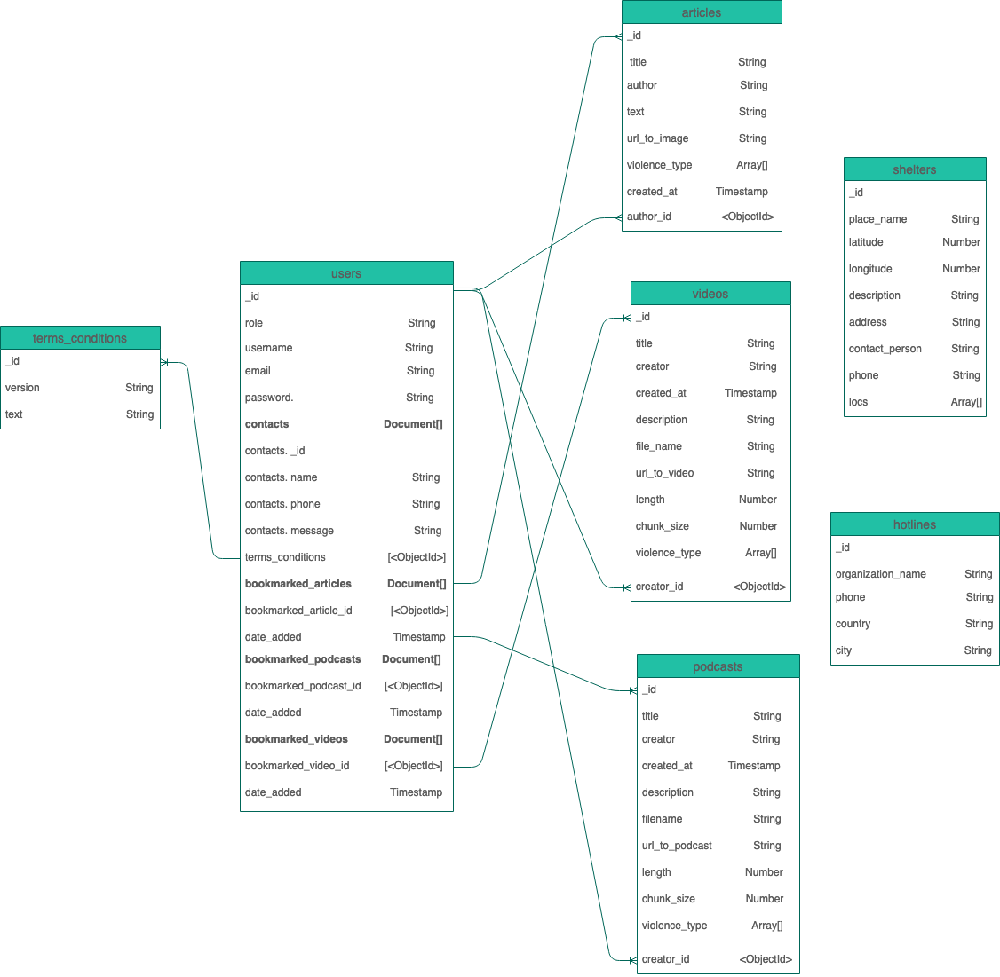
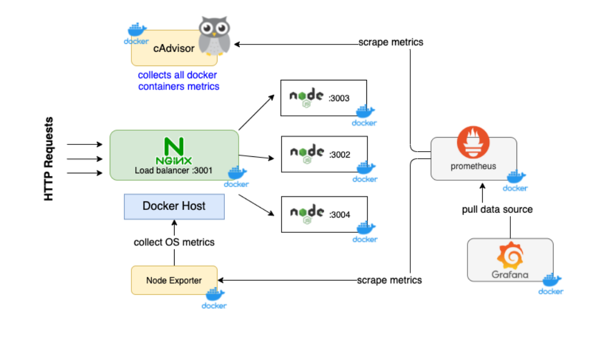
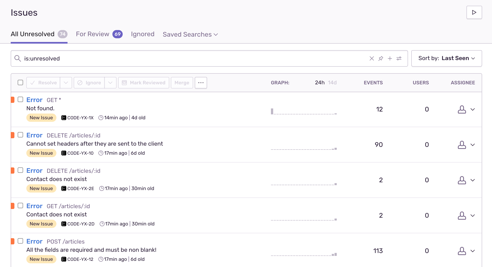
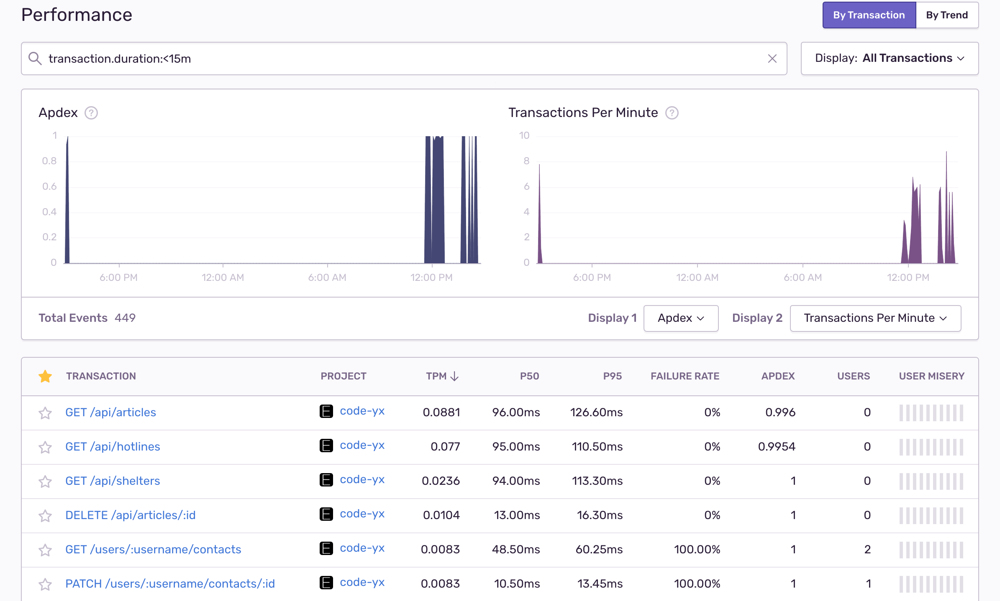
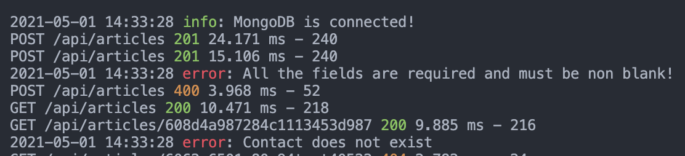
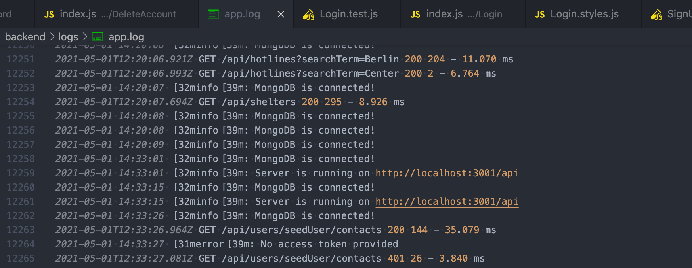
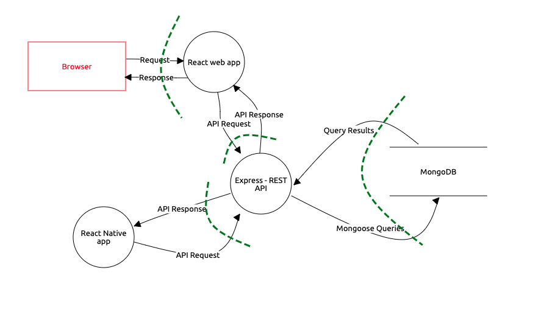

[](https://depfu.com/github/no-domestic-violence/backend?project_id=17563)
[](https://depfu.com/github/no-domestic-violence/backend?project_id=17563)

## Table of contents

- [Project Description](#project-description)
- [Tech Stack](#tech-stack)
- [Application architecture diagram](#application-architecture-diagram)
- [Data Model](#--data-model)
- [Folder structure](#folder-structure)
- [Setup](#setup)
- [HTTPS Certificates](#https-certificates)
- [OWASP Dependency Check](#owasp-dependency-check)
- [Security Measures by Web Application Security Risks according to OWASP](#security-measures-by-web-application-security-risks-according-to-owasp)
- [Authors of the project](#authors-of-the-project)

## Project Description

POOL project is a mobile application that aims to help the survivors of domestic violence. The main features of the app are: resources in forms of curated articles, videos & podcasts about intimate partner violence, finding shelters and hotlines. Signed up users can have additional access to emergency contact features.

**The api uses Heroku for production**

- Production URL: https://pool-api-mobile.herokuapp.com/api/
- Not protected endpoints: /shelters, /hotlines

## Tech Stack

- Node.js
- Express
- Mongoose
- Mongo DB
- Json Web Token
- Jest
- Heroku

## Application Architecture Diagram


The components implements the following functionalities:

- React Native: User registration, login, browse educational resources and add/delete bookmarks, search hotlines and shelters on map, show/create/edit/remove emergency contacts.
- Express/node.js server: Abstracts access to database for clients with RESTful API using Mongoose library: user management (login, register, delete, authorization of different roles), emergency contact management (read, add, edit, remove), articles (read, add, edit, remove), videos, shelters, hotlines.
- MongoDB database: stores the user related data (login credentials, emergency contacts), geospatial data for shelters, resources, hotlines, and T&C.

## Data Model

Why NoSQL ?

###

The main reasons for choosing MongoDB in POOL project are as below:

- Flexibility → Since the Pool project is in the development phase, it does not have fixed data models. Therefore, the database system may need to accommodate frequent design changes and new features.
- Prioritizing scalability over consistency→ The project needs to store dynamic structured data at large scale
- Performing Geolocation Operations → Map is one of the main features of the app which needs frequent and fast geospatial querying.
- Storing large volumes of data without relations → Some of the collections such as shelters, hotlines and resources do not have relations.



Basic users can perform CRUD operations on contacts and bookmarks. Authorized user with editor or admin role can perform CRUD operations on articles, videos, and podcasts.

Contacts document is embedded in the users collection for optimal querying. Since a user can have maximum 2 emergency contacts (one-to-few relationship), the document size would not exceed the limit.

Each article, video, podcast has one or few violence type tags. The number of violence types are limited, thus another collection is not needed.

## API Swagger Documentation

http://pool-api-mobile.herokuapp.com/api-docs/

## Setup

**To run locally**

1. Clone this repo by running the following command:

```s
git clone https://github.com/no-domestic-violence/backend.git
cd backend
```

2. Install dependencies:

```s
yarn install
```

3. Create .env file and add following information:

```s

  mongoURI = mongodb atlas uri
  JWT_ACCESS_TOKEN_SECRET = jwt access token secret string
  JWT_REFRESH_TOKEN_SECRET = jwt refresh token secret string
  SENTRY = team sentry link
```

4. Start environment

```s
yarn dev
```

5. Open http://localhost:3001/api to view it in the browser.

6. Before merging to master

- check lint and prettier rules

```s
yarn lint
```

- run tests

```s
yarn test
```

**Load Balancing with NGINX and Docker**



1. Build dockerized image of the app

```s
docker build -t load-balanced-app .
```

2. Run the app instances

```s
docker run -e "INSTANCE=First" -p 3002:3001 -d load-balanced-app
docker run -e "INSTANCE=Second" -p 3003:3001 -d load-balanced-app
docker run -e "INSTANCE=Third" -p 3004:3001 -d load-balanced-app
```

3. cd to nginx directory, build and run the load balancer

```s
docker build -t nginx-load-balancer .
docker run -p 3001:80 -d nginx-load-balancer
```

Then the NGINX load balancer on port 3001 distributes the requests to 3 server instances.

**Caching**

1. Install Redis

- On Mac:

```s
brew install redis
```

2. Launch Redis before you run the server

```s
brew services start redis
```

3. Stop Redis

```s
brew services stop redis
```

**Testing**

App uses Jest and supertest (HTTP assertions library)

- Run tests

```s
yarn test
```

**Application monitoring**

App uses Sentry as application monitoring and error tracking.




To monitor docker containers on grafana:

```s
docker-compose up
```

**Aplication logging**

Winston and morgan (HTTP logger) display logs on terminal and logs are collected on a separate log file.





**To use Heroku for development**

1. Check that app is running

```s
heroku local
```

2. To check builds

```s
heroku builds
```

3. To cancel builds

```s
heroku build:cancel
```

---
## HTTPS Certificates

In order to run https with certificates (locally for one server in development mode):

1. generate a private key
```s
openssl genrsa -aes128 -out private.key 2048
```

2. generate a public key from private key
```s
openssl rsa -pubout -in private.key -out public.key
```
3. generate request
```s
openssl req -new  -key private.key -out request.csr
```
4. generate certificate
```s
openssl x509 -req -days 3 -in request.csr -signkey private.key -out certificate.crt
```
## OWASP Dependency Check.

1. Make sure you have OWASP dependency-check

2. Create directory for report
```s
mkdir vulnerabilities
```
3. Generate report 
```s
dependency-check --scan ./ -f JSON -f HTML -f XML -o vulnerabilities
```

## Security Measures by Web Application Security Risks according to OWASP


* NoSQL Injection
  * Use input sanitization
  * Ensure that the database queries are not constructed directly from user-controlled data
* Broken Authentication
  * Use JWT authentication token
  * Use JWT refresh token
  * Use standard Authorization: Bearer < access token >
  * Limit failed login attempts
  * Increase password length
  * Increase password strength
  * Implement weak password check
* Sensitive Data Exposure
  * Store sensitive data in encrypted secure storage (client side)
  * Store password using strong, salted hashing function with Bcrypt
  * Enforce encryption using HTTP Strict Transport Security
  * Encrypt all data in transit with secure TLS protocol
  * Prevent using cache for sensitive data
  * Use hpp express middleware to prevent HTTP parameter pollution
* Security Misconfiguration
  * Keep error messages short
  * Use eslint-plugin-security and Sonar Cloud to identify potential security hotspots
* Cross-Site Scripting XSS
  * Use React JS and React Native that automatically escape XSS by design
  * Enable and customise Content Security Policy (CSP)
  * Validate all user inputs (client and server)
* Using Components with Known Vulnerabilities
  * Use OWASP Dependency Check
* Reverse Engineering (mobile)
  * Use an obfuscation tool
* Clickjacking
  * Implement X-Frame-Options via Content 

## Authors of the project:

- Soyoon Choi : User(contacts) API, setup error handler, authorization, setup loggers and monitoring, API documentation
- Irina Baeva : Setup production and development environment (yarn, babel, lint),
  API: Articles (Create, Edit, Delete), Hotlines (Get searching), Shelters, Video (including handling multipart/form-data for image), Caching with Redis on development mode, Setup logging and monitoring.
- Behnaz Derakhshani : Authentication (signup, login, changepassword, deleting account) & error handling and expectation, API: Articles(Read), API documentation
